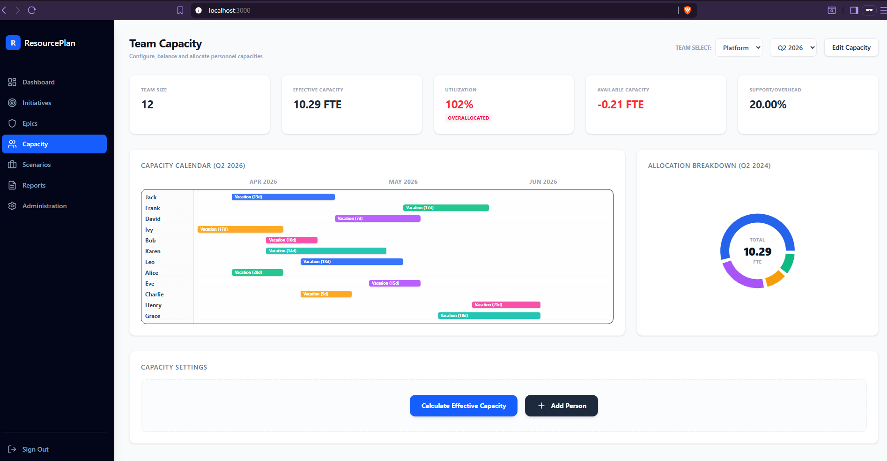

Capacity Planner Tool

Technology used:
Spring Boot 3.5.14
Java jdk 17
•	React: ^19.0.1
•	Vite: ^6.2.3
PostgreSQL

To start the database, open Backend folder and run
docker compose up
Import the database backup from the database folder: backup.sql.

Build the backend from the capacity folder with maven and run it.
Build the frontend with npm and run:
npm install
npm run dev

The frontend is generated using Google AI Studio with the Gemini model.
Images for the screens for the app were generated with ChatGPT and imported in Google AI Studio.

The application uses role based secure login with JWT token generation. The bearer token is sent to authenticate when calling other endpoint besides register and login.
BCryptPasswordEncoder is used for one-way hashing of passwords when storing them in the database.
In the backend, N+1 problem is avoided by using JOIN FETCH in JPQL queries.
The entities used for the business logic are initiatives, epics, teams, persons and years with each associated quarter used to store the total number of working days for a quarter.
The logic for the capacity is based on FTE (full-time equivalent) for a person. Each person without vacation days or support overhead in a quarter is considered to have 1 FTE.
 The total team capacity for a quarter, for a given year, is calculated in the interface and stored in a team_capacity table for later use.

Endpoints used: 
POST http://localhost:8080/auth/login
{
    "username": "alice@gmail.com",
    "password": "1234"
}

POST http://localhost:8080/auth/register
{
    "username":"admin@gmail.com",
    "email":"admin@gmail.com",
    "password": "1234"
}

To create an initiative: 
POST http://localhost:8080/api/initiatives
{
  "name": "New Market Expansion",
  "description": "Expand business operations into new regional and international markets by enabling localized digital experiences, scalable infrastructure, regulatory compliance capabilities, and market-specific product offerings.",
  "startDate": "2027-01-15",
  "endDate": "2028-03-31",
  "owner": "Sophia Martinez",
  "strategicObjective": "Increase revenue growth and global market presence through strategic expansion initiatives",
  "deliveryConfidence": 74.80,
  "predictedCompletion": "2028-02-10"
}

To create an epic and attach it to an existing initiative:
POST http://localhost:8080/api/initiatives/1/epics
{
  "name": "Unit Tests",
  "effort": 100,
  "status": "COMPLETED",
  "requiredFte": 3.50
}

To get all initiatives and their epics: 
GET http://localhost:8080/api/initiatives

To calculate the effective capacity for a team and store it in the database:
POST http://localhost:8080/api/teams/1/capacity/calculate?year=2026&quarter=2

To get all teams, the associated persons and the team capacity: 
GET http://localhost:8080/api/teams

To create a person:
POST http://localhost:8080/api/teams/1/persons
{
  "name": "John Doe",
  "vacationDays": 25
}

To get all teams from all the epics of an initative: 
GET http://localhost:8080/api/initiatives/1/teams
